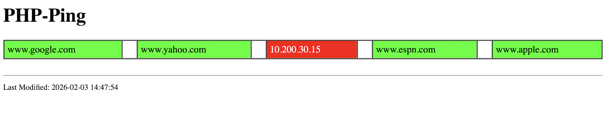

# php-ping
Simple PHP Ping Monitoring Script

* Add hosts to php-ping.txt.
* Adjust the number of columns if desired.
* Due to latency
  * cron job ( 05 * * * * 'php /var/www/html/php-ping/php-ping.php' > php-ping.html 2>&1 )
  * billboard.html -->  Will cyccle through sequence of wab pages ever 8 seconds.

